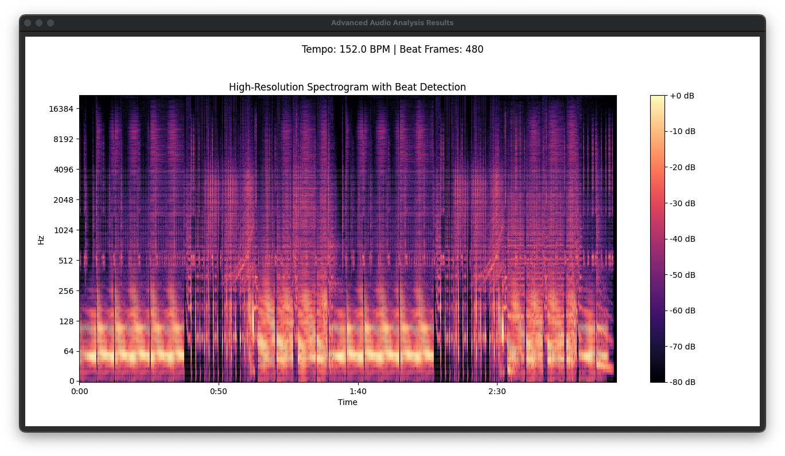

# WaveForm

Digital Application for playing music with an analysis tool.




---

## Installation Guide

### Prerequisites

Before installing WaveForm, ensure your system meets the following requirements:

- **Python:** Version 3.10 or newer.

---

### Steps to Install

1. **Clone or Download the Repository**
   - Clone using Git:
     ```bash
     git clone https://github.com/your-repo/WaveForm.git
     cd WaveForm
     ```
   - Alternatively, download the repository as a ZIP file from GitHub and extract it.

2. **Install Requirements**
   - Install necessary Python packages from the `requirements.txt` file:
     ```bash
     pip install -r requirements.txt
     ```

3. **Set Up the Database**
   - Import the provided database schema to your database management system:
     - Locate the file `WaveForm_db.sql` in the `/db` folder.
     - Import the SQL file to create the database. For example:
       ```bash
       mysql -u your_username -p your_database_name < db/WaveForm_db.sql
       ```
   - Ensure the database is running and accessible by the application.

4. **Run WaveForm**
   - Start the application:
     ```bash
     python main.py
     ```

---

### Additional Notes

- **Database Configuration**
  - Ensure the database connection details (e.g., host, username, password) are properly set in the application's configuration file, if required.

- **Troubleshooting**
  - If you encounter any issues, check the logs or consult the [GitHub Issues page](#) for assistance.

---

Enjoy using **WaveForm** to play and analyze your favorite tracks! 🎵
